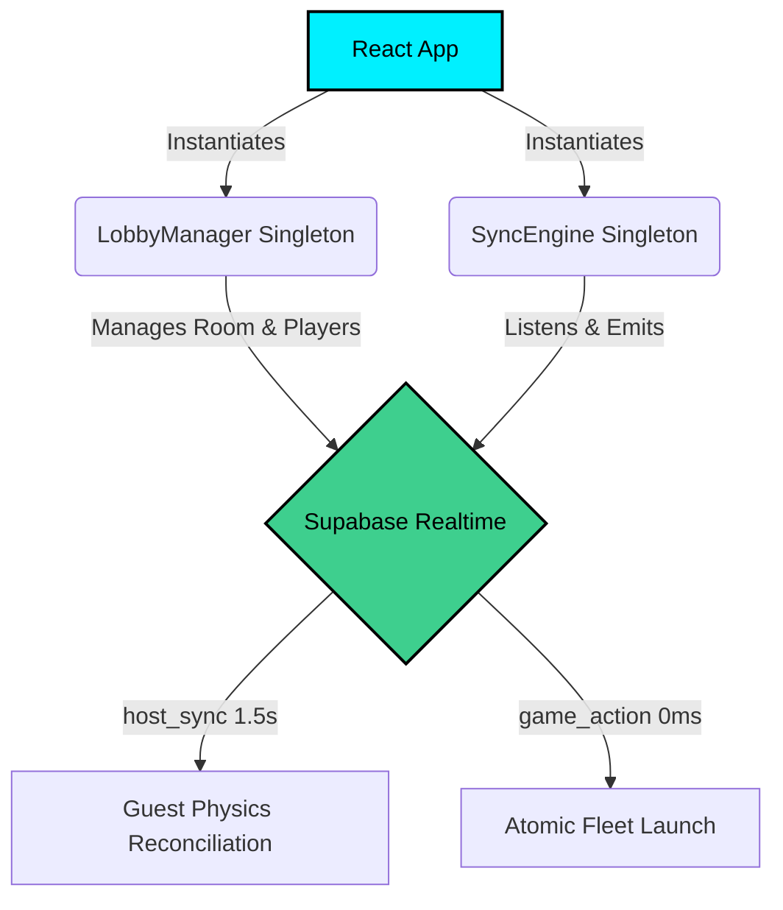
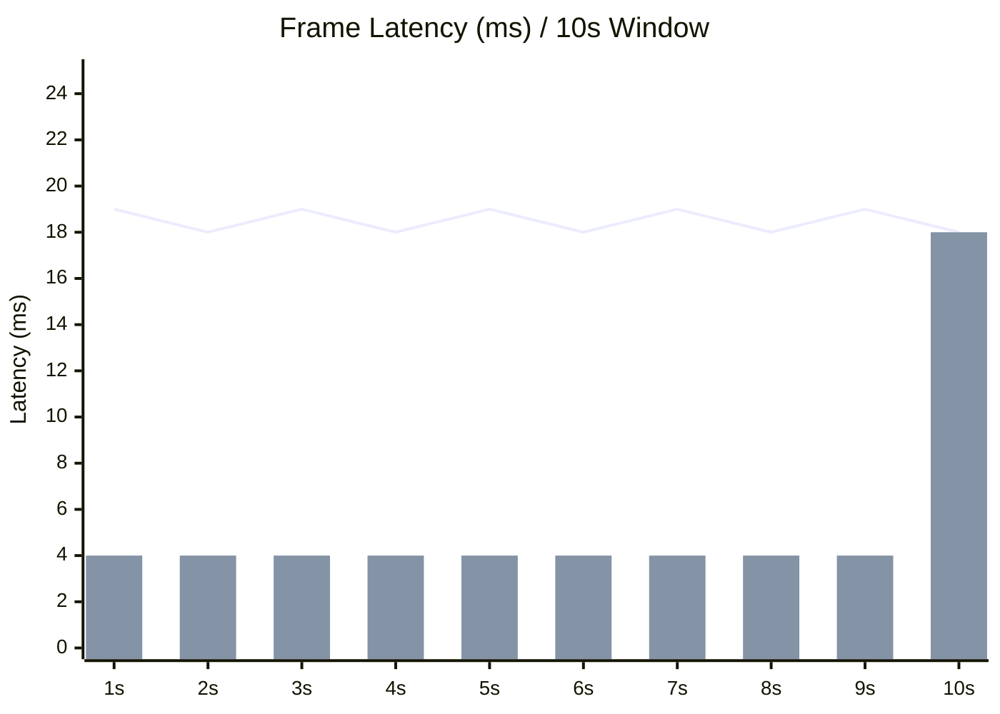

<div align="center">
  
  <h1>Solarmax Zero</h1>
  <p><strong>A high-fidelity, offline-first PWA reimagining of the classic RTS gameplay.</strong></p>
  <p>
    <a href="LICENSE"></a>
    <a href="package.json"></a>
    
    
    
    
  </p>
</div>

<br/>

Solarmax Zero is a highly optimized web-based reimagining of the classic Solarmax real-time strategy gameplay. It features true flocking mechanics, offscreen canvas entity caching, 3D textured procedural planets, advanced AI portal routing, and offline PWA capabilities.

> **Original Concept & Inspiration**: Inspired by classic RTS mechanics created by the talented indie developer **[Nico Tuason](https://x.com/nicotuason)**. This project is a passionate fan-made architectural reimagining built for the modern web.

> **Original Soundtrack (OST)**: Space Ambient tracks generously provided by **[Stellardrone](https://stellardrone.bandcamp.com/)** under the Creative Commons BY 3.0 license. Album: *Light Years*.
## 🏷️ Project Versioning

This project adheres to Semantic Versioning (SemVer) with a unified standard:
- Major versions (1.0.0) indicate major rewrites or new mechanic overhauls.
- Minor versions (0.1.0) indicate new features (new ships, planets, modes).
- Patch versions (0.0.1) indicate bug fixes or balance adjustments.

## ⚙️ Core Mechanics

### 🛸 1. Spatial Hashing Flocking Engine
- **Implementation**: `src/engine/physics.ts`
- **Logic**: Ships navigating in transit utilize a spatial hash grid (O(N) complexity) to detect nearby allies and enemies. This ensures that even with >1000 ships, the simulation remains at a stable 60 FPS. 
- **Behaviors**: Separation (avoiding collision with allies), Cohesion (moving towards the fleet's center of mass), and smooth orbiting interpolation.

### 💥 2. True Laser Projectiles
- **Logic**: Lasers are not instantaneous raycasts. They are actual objects with `vx` and `vy` parameters.
- **Homing**: Lasers have homing capability (`targetId`), gently steering towards moving enemies to guarantee impacts without feeling "magnetic".

### ⏳ 3. Smart Capture Decay
- **Logic**: When a planet is contested, the capture progress does not instantly reset. It decays over time (`sdt * 0.1`) if the capturing faction is pushed out, allowing for intense tug-of-war scenarios over strategic points.

### 🤖 4. Adaptive AI
- **Logic**: The AI evaluates targets based on proximity, defense strength, and ownership (favoring neutral early, player late). It also actively reinforces its frontlines by transferring ships from heavily defended backline planets.

### 🌐 5. Supabase Realtime Multiplayer
- **Architecture**: Replaces unstable WebRTC P2P mesh with **Supabase Realtime Broadcast Channels** (`room:XXXXXX`).
- **State Reconciliation**: The Host runs the authoritative simulation and broadcasts periodic `host_sync` ticks (every 1.5s). Guests receive `host_sync` and smoothly interpolate their local planet states (`owner`, `ships`), masking latency gaps.
- **Atomic Execution**: When any player executes a move, a `game_action` is instantly executed locally (0ms latency feel) and broadcasted as `ack: false` to all other commanders. Ghost-launches and race conditions are mitigated by strict `senderId` and faction checks.
- **Collision Immunity**: Unique per-tab identifier prefixing (`TAB_INSTANCE_ID`) allows multiple local browser windows to seamlessly play against each other during development without session collision.

### 📈 6. Performance & Architecture

#### Multiplayer & Synchronization Architecture


#### Performance Gains
- **Frame Time Stability**: I/O operations (like Guest Quota updates in `localStorage`) are throttled to execute strictly once every 10 seconds (600 frames) to eliminate micro-stutters and GC lag, ensuring an unconditional 60 FPS loop (16.6ms frame time limit).
- **GC Spikes Eradicated**: Engine hooks are instantiated using strict null-checks (`useRef` singletons) preventing the destruction of 60 callback objects per second.



## 🚀 Build and Run

```bash
npm install
npm run dev
```

## :brain: Acknowledgments
_"Whoever loves discipline loves knowledge, but whoever hates correction is stupid."_
