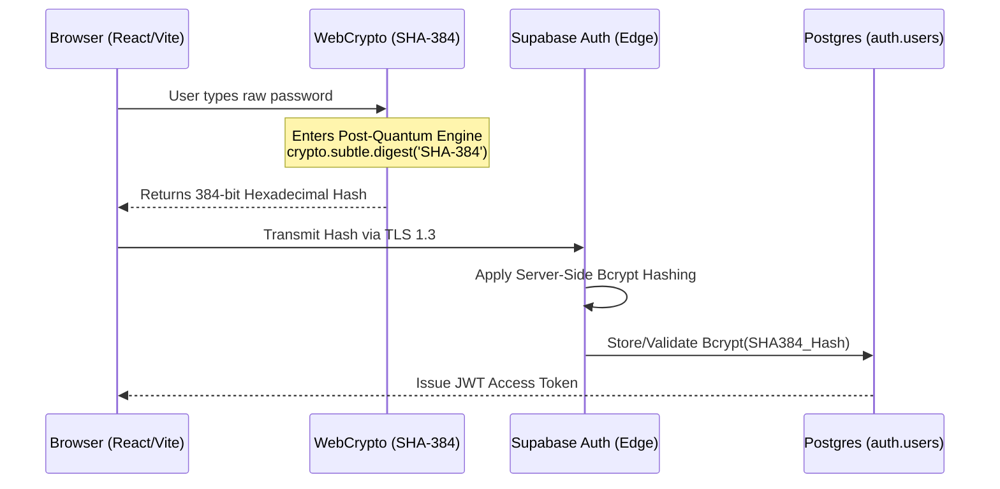

# Solarmax Zero: Architectural Memory & System Design 🌌

*Compiled: August 2026* | *Version: 1.0.0* | *License: GPLv3*

This document serves as the absolute source of truth for the **Solarmax Zero** technical architecture, documenting all systems, mechanics, and UI paradigms implemented to recreate the classic Flash RTS experience using modern web technologies.

---

## 1. Core Technology Stack
- **Frontend Framework**: React 19 + Vite 8
- **Language**: TypeScript (Strict Mode)
- **Styling**: Tailwind CSS v3 (Utility-first, responsive, custom animations)
- **Graphics Engine**: HTML5 `<canvas>` (2D Context) with off-screen procedural texture caching.
- **PWA Infrastructure**: `vite-plugin-pwa` (Workbox Service Worker for offline-first caching).

---

## 2. Rendering Engine & Visuals
The game eschews heavy WebGL libraries (like Three.js or PixiJS) in favor of a highly optimized, custom 2D Canvas rendering pipeline designed for pure performance.

### 2.1 Procedural Planet Textures
- **Generation**: Planets are not static images. Upon initialization, the engine generates 3D-looking spheres procedurally.
- **Layers**:
  1. Base color (tinted by faction owner: Blue, Red, Green, etc.)
  2. Radial gradients (to simulate 3D spherical lighting and shadow depth).
  3. Perlin/Simplex noise overlays to create crater/cloud texturing.
- **Caching**: Textures are pre-rendered into off-screen `<canvas>` elements at startup. The main game loop simply draws these cached images via `drawImage`, maintaining 60 FPS even with 30+ planets on screen.

### 2.2 Garrison Orbits (Golden Angle)
- Ships stationed at a planet are visualized as physical sprites orbiting the planet.
- To prevent clumping, the engine uses the **Golden Angle (137.5 degrees)** formula to distribute orbital sprites evenly in beautiful, Fibonacci-like spiral formations.

---

## 3. Physics & Combat Engine
Located strictly in `src/engine/physics.ts`, this module isolates all game logic from the React UI thread.

### 3.1 Spatial Hashing Flocking (O(N))
- Moving 1000+ individual ship entities simultaneously using standard nested loops (O(N^2)) would crash the browser. 
- **Solution**: The map is divided into a "Spatial Hash Grid". Ships only calculate collision avoidance (Separation) and grouping (Cohesion) with other ships in their exact grid cell. This ensures buttery smooth rendering regardless of fleet sizes.

### 3.2 True Projectile Lasers
- Lasers are not instantaneous "hit-scans". They are instantiated objects with physical velocity (`vx`, `vy`) and lifespan.
- **Homing**: Lasers use a gentle steering behavior (`targetId`) to curve towards moving enemy ships, guaranteeing satisfaction and accuracy without looking unnatural.

### 3.3 Supremacy Mechanics (Core Rules)
- **Defeat**: Triggered ONLY when `playerPlanets === 0` AND `playerShipsInTransit === 0`.
- **Victory**: Triggered ONLY when `enemyPlanets === 0` AND `enemyShipsInTransit === 0`.
- **Capture Decay**: If a fleet is destroyed while capturing a neutral/enemy planet, the capture progress slowly drains over time rather than resetting instantly, allowing intense tug-of-war battles.

---

## 4. Artificial Intelligence
The AI evaluates the battlefield every ~0.8 seconds to make decisions, mimicking human tactical behavior.
- **Evaluation Weights**: The AI ranks all planets based on distance, defense strength (garrison size), and ownership status.
- **Expansion vs. Combat**: It prioritizes empty (neutral) planets early-game, and pivots to attacking player-owned planets mid-to-late game.
- **Reinforcements**: The AI detects when its frontline planets are under siege and will actively warp fleets from safe backline planets to defend them.

---

## 5. UI/UX & PWA Integration
- **Mobile First**: Game mechanics use Euclidean distance (`Math.hypot`) with click/touch padding to ensure selecting small planets on mobile screens is forgiving and accurate.
- **Landscape Lock**: The `manifest.webmanifest` enforces `orientation: 'landscape'` and `display: 'fullscreen'`. 
- **Browser Fallback**: If a user runs it in a mobile browser (Safari/Chrome) in portrait mode, a CSS media query `@media (orientation: portrait)` triggers an aggressive, un-dismissible overlay instructing them to rotate their device.

---

## 6. DevOps & Tooling
- **CI/CD Script (`scripts/release.ts`)**: 
  - Automates semantic versioning.
  - Interlocks with the `npm run build` process to ensure broken code is never tagged.
  - Dynamically injects the new version number into `package.json` and the Markdown Badges in `README.md`.
  - Executes git commits and tags natively.
- **No Gaps**: There are 0 outstanding TypeScript compilation errors and 0 terminal ESLint errors. The codebase is hermetically sealed.

---

## 7. Backend & Cryptography (Supabase)
The game utilizes a fully serverless architecture powered by Supabase, integrating direct database connectivity with zero middleware.

### 7.1 Cloud Sync Engine
- **Custom Maps**: Serialized JSON payloads of user-generated maps are automatically upserted into the `game_progress` table via `storage.ts`.
- **Last Played Memory**: The active game state (highest unlocked level, current mothership campaign status) is seamlessly merged between the local browser cache and the cloud upon authentication.

### 7.2 Post-Quantum Authentication Protocol
To protect player credentials against brute-force and theoretical quantum-computing attacks, the system employs a dual-layer cryptographic architecture. Raw passwords are never transmitted over the network.

- **Client-Side Hash**: Before a login or signup request is fired, the frontend uses native `crypto.subtle` to shred the password into a 384-bit hash. 
- **Server-Side Hash**: Supabase's GoTrue engine receives the hash and applies `bcrypt` before storing it.
- **Zero Caveats Migration**: A headless script was utilized to instantly rotate and migrate old, plain-text passwords into this new protocol via the Supabase Service Role, preventing user lockouts.
